# Modern Login Forms

*Created by [Aigars Silkalns](https://github.com/puikinsh/) for [Colorlib](https://colorlib.com)*

A curated collection of beautiful, responsive login form templates built with pure HTML, CSS, and JavaScript. Each form is designed to be completely self-contained and copy-paste ready for use in any project.

## 🌟 About Colorlib

Looking for more amazing form designs? Check out Colorlib's extensive collections:
- 📋 [Login Forms Collection](https://colorlib.com/wp/cat/login-forms/) - Browse hundreds of login form designs
- 🎨 [HTML5 & CSS3 Login Forms](https://colorlib.com/wp/html5-and-css3-login-forms/) - Modern form templates and tutorials

## 🚀 Features

- **Pure HTML/CSS/JS** — no frameworks, no build step, no package manager
- **Copy-paste ready** — drop a single `forms/<name>/` folder into any project
- **Shared `LoginFormBase` class** — every form inherits validation, lifecycle, and accessibility behavior from one place; per-form scripts average ~50 lines
- **Responsive** — mobile-first across all 20 designs
- **Accessible by default** — `:focus-visible` keyboard rings, `prefers-reduced-motion` honored globally, ARIA on icon controls, semantic markup
- **SEO + social ready** — meta description, Open Graph, Twitter card, and SVG favicon on every form
- **No external dependencies** — works fully offline, no CDN, no Google Fonts
- **Cross-browser** — Chrome 88+, Firefox 103+, Safari 15.4+, Edge 88+

## 🖼️ Form Gallery

### Complete Collection - 19 Unique Login Forms

<div align="center">
  <table>
    <tr>
      <td align="center" width="33%">
        <a href="https://puikinsh.github.io/login-forms/forms/glassmorphism/">
          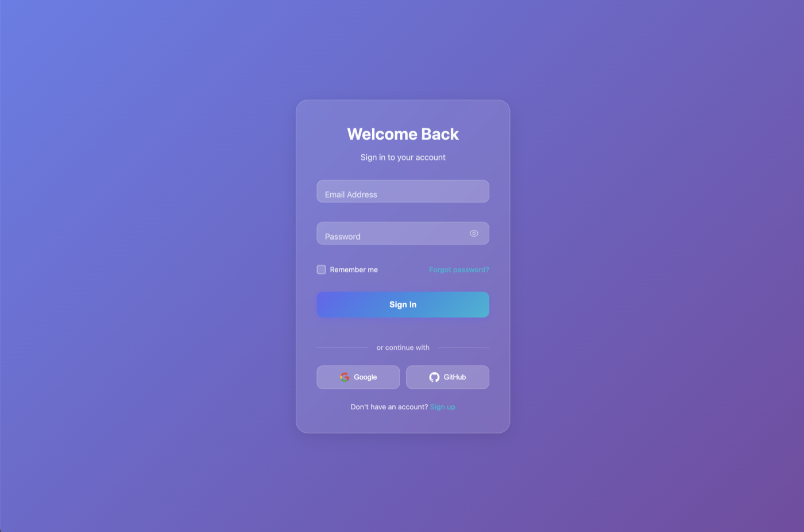
        </a>
        <br>
        <b>Glassmorphism</b><br>
        <sub>Frosted glass effects</sub><br>
        <a href="https://puikinsh.github.io/login-forms/forms/glassmorphism/">Live Demo</a> | <a href="forms/glassmorphism/">Source</a>
      </td>
      <td align="center" width="33%">
        <a href="https://puikinsh.github.io/login-forms/forms/neon/">
          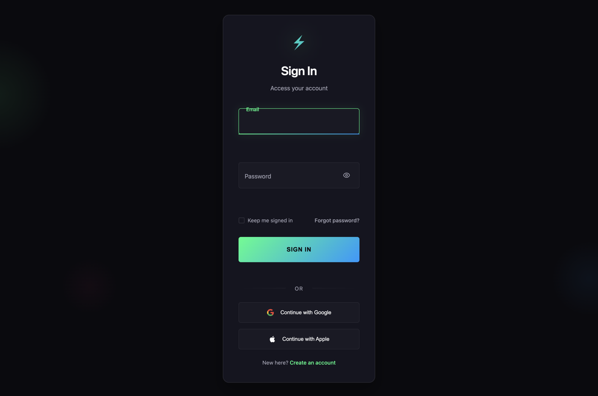
        </a>
        <br>
        <b>Neon Minimalist</b><br>
        <sub>Dark theme with neon</sub><br>
        <a href="https://puikinsh.github.io/login-forms/forms/neon/">Live Demo</a> | <a href="forms/neon/">Source</a>
      </td>
      <td align="center" width="33%">
        <a href="https://puikinsh.github.io/login-forms/forms/gradient-wave/">
          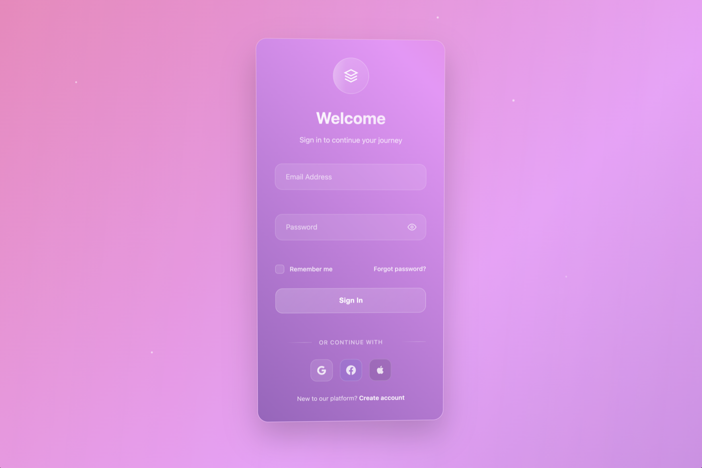
        </a>
        <br>
        <b>Gradient Wave</b><br>
        <sub>Animated gradients</sub><br>
        <a href="https://puikinsh.github.io/login-forms/forms/gradient-wave/">Live Demo</a> | <a href="forms/gradient-wave/">Source</a>
      </td>
    </tr>
    <tr>
      <td align="center">
        <a href="https://puikinsh.github.io/login-forms/forms/neumorphism/">
          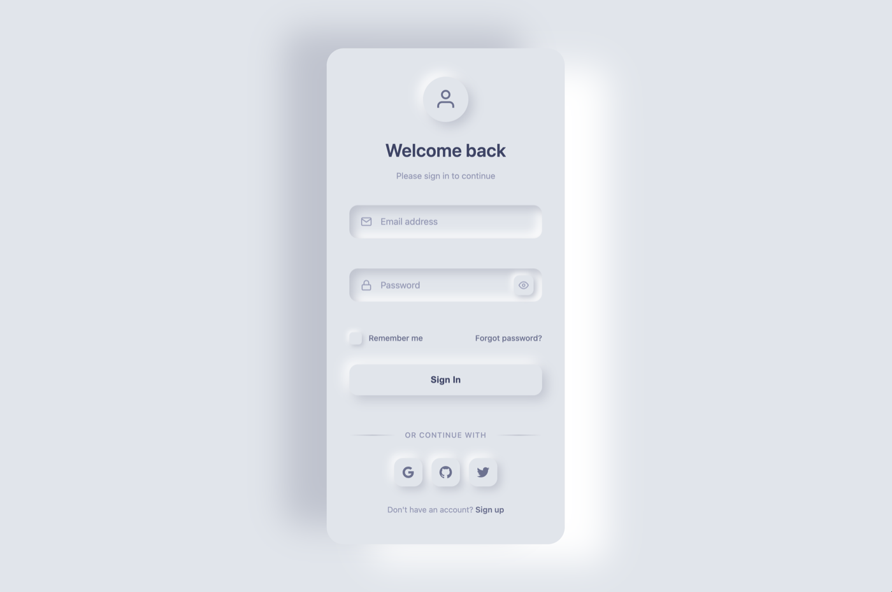
        </a>
        <br>
        <b>Neumorphism</b><br>
        <sub>Soft UI design</sub><br>
        <a href="https://puikinsh.github.io/login-forms/forms/neumorphism/">Live Demo</a> | <a href="forms/neumorphism/">Source</a>
      </td>
      <td align="center">
        <a href="https://puikinsh.github.io/login-forms/forms/corporate/">
          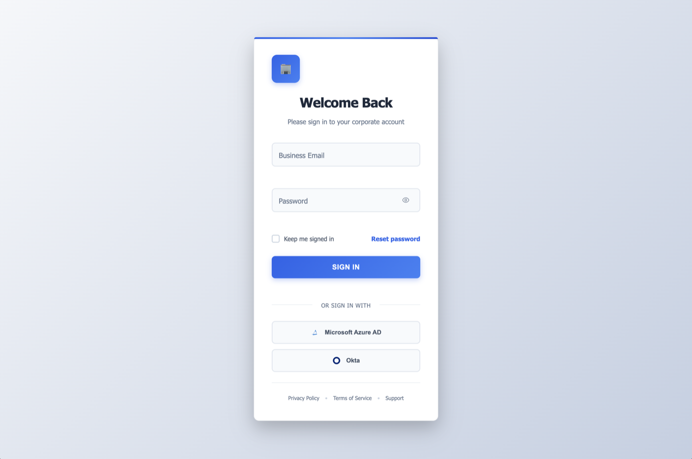
        </a>
        <br>
        <b>Corporate Professional</b><br>
        <sub>Enterprise-grade</sub><br>
        <a href="https://puikinsh.github.io/login-forms/forms/corporate/">Live Demo</a> | <a href="forms/corporate/">Source</a>
      </td>
      <td align="center">
        <a href="https://puikinsh.github.io/login-forms/forms/material/">
          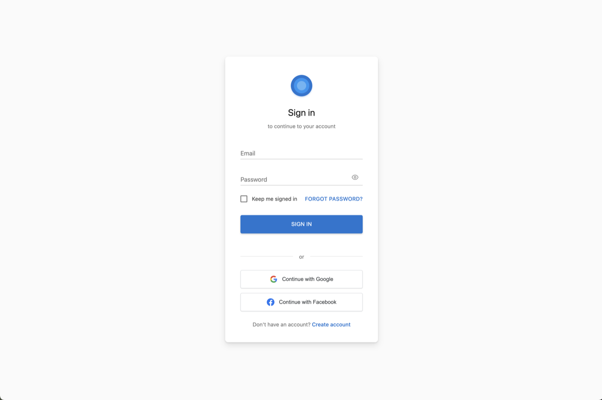
        </a>
        <br>
        <b>Material Design</b><br>
        <sub>Google's Material UI</sub><br>
        <a href="https://puikinsh.github.io/login-forms/forms/material/">Live Demo</a> | <a href="forms/material/">Source</a>
      </td>
    </tr>
    <tr>
      <td align="center">
        <a href="https://puikinsh.github.io/login-forms/forms/basic/">
          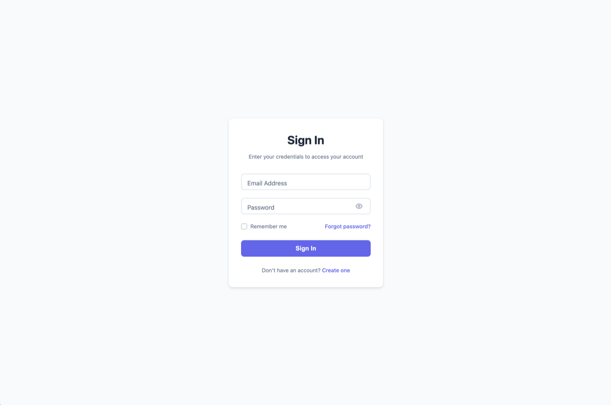
        </a>
        <br>
        <b>Basic Form</b><br>
        <sub>Clean & simple</sub><br>
        <a href="https://puikinsh.github.io/login-forms/forms/basic/">Live Demo</a> | <a href="forms/basic/">Source</a>
      </td>
      <td align="center">
        <a href="https://puikinsh.github.io/login-forms/forms/minimal/">
          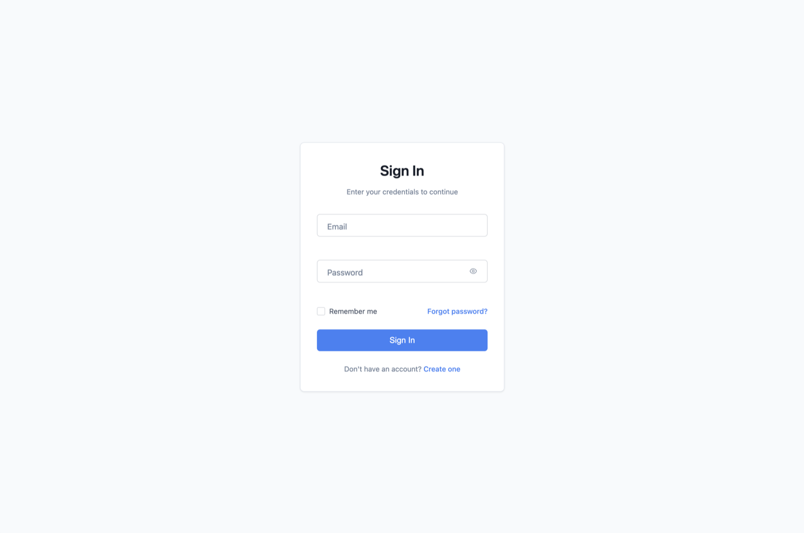
        </a>
        <br>
        <b>Minimal Clean</b><br>
        <sub>Ultra-minimal design</sub><br>
        <a href="https://puikinsh.github.io/login-forms/forms/minimal/">Live Demo</a> | <a href="forms/minimal/">Source</a>
      </td>
      <td align="center">
        <a href="https://puikinsh.github.io/login-forms/forms/creative/">
          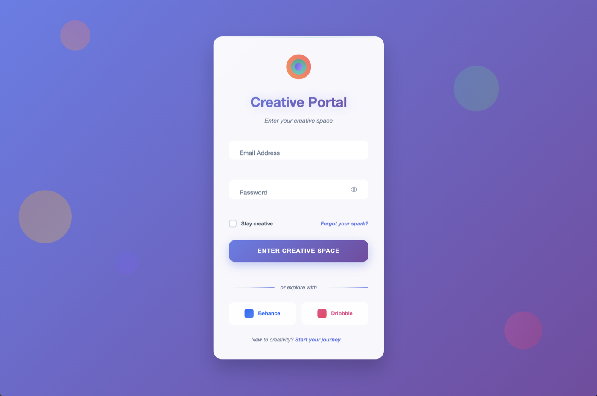
        </a>
        <br>
        <b>Creative Portal</b><br>
        <sub>Interactive animations</sub><br>
        <a href="https://puikinsh.github.io/login-forms/forms/creative/">Live Demo</a> | <a href="forms/creative/">Source</a>
      </td>
    </tr>
    <tr>
      <td align="center">
        <a href="https://puikinsh.github.io/login-forms/forms/eco-wellness/">
          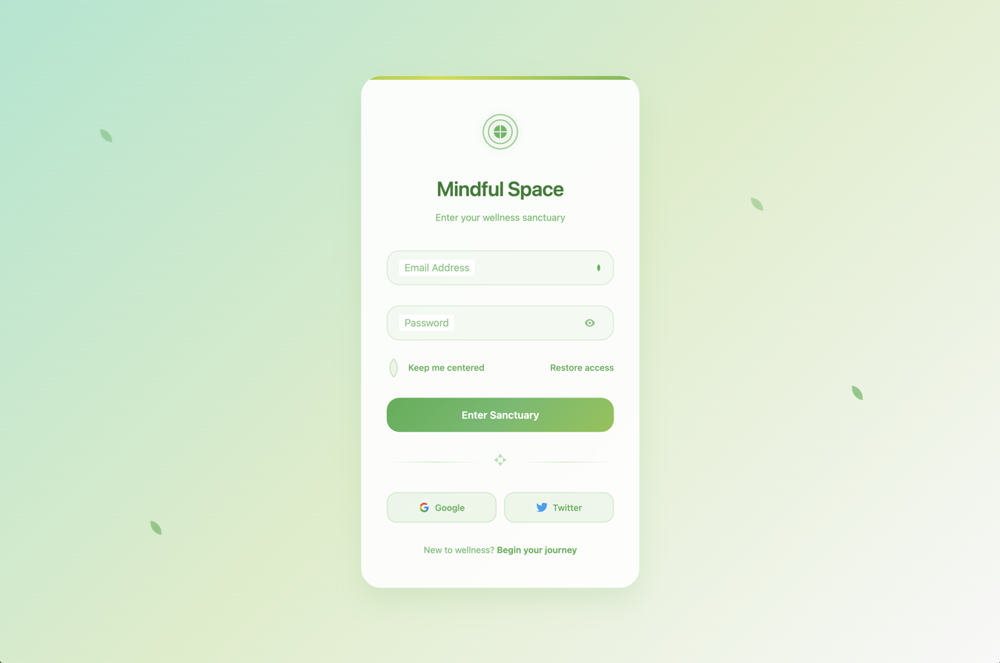
        </a>
        <br>
        <b>Eco Wellness</b><br>
        <sub>Nature-inspired</sub><br>
        <a href="https://puikinsh.github.io/login-forms/forms/eco-wellness/">Live Demo</a> | <a href="forms/eco-wellness/">Source</a>
      </td>
      <td align="center">
        <a href="https://puikinsh.github.io/login-forms/forms/ai-assistant/">
          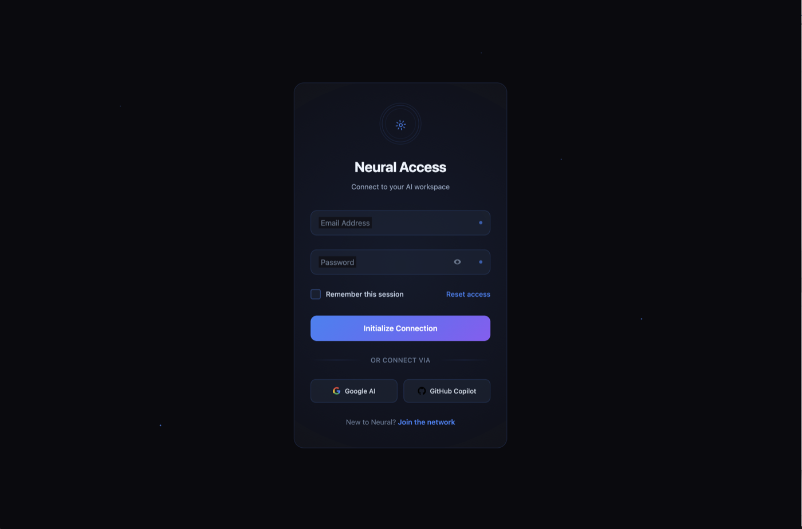
        </a>
        <br>
        <b>AI Assistant</b><br>
        <sub>Neural network theme</sub><br>
        <a href="https://puikinsh.github.io/login-forms/forms/ai-assistant/">Live Demo</a> | <a href="forms/ai-assistant/">Source</a>
      </td>
      <td align="center">
        <a href="https://puikinsh.github.io/login-forms/forms/neon-cyber/">
          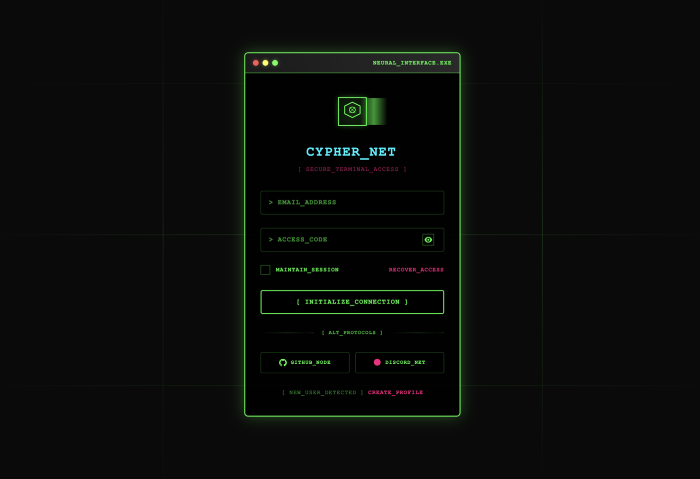
        </a>
        <br>
        <b>Neon Cyber</b><br>
        <sub>Cyberpunk aesthetic</sub><br>
        <a href="https://puikinsh.github.io/login-forms/forms/neon-cyber/">Live Demo</a> | <a href="forms/neon-cyber/">Source</a>
      </td>
    </tr>
    <tr>
      <td align="center">
        <a href="https://puikinsh.github.io/login-forms/forms/soft-minimalism/">
          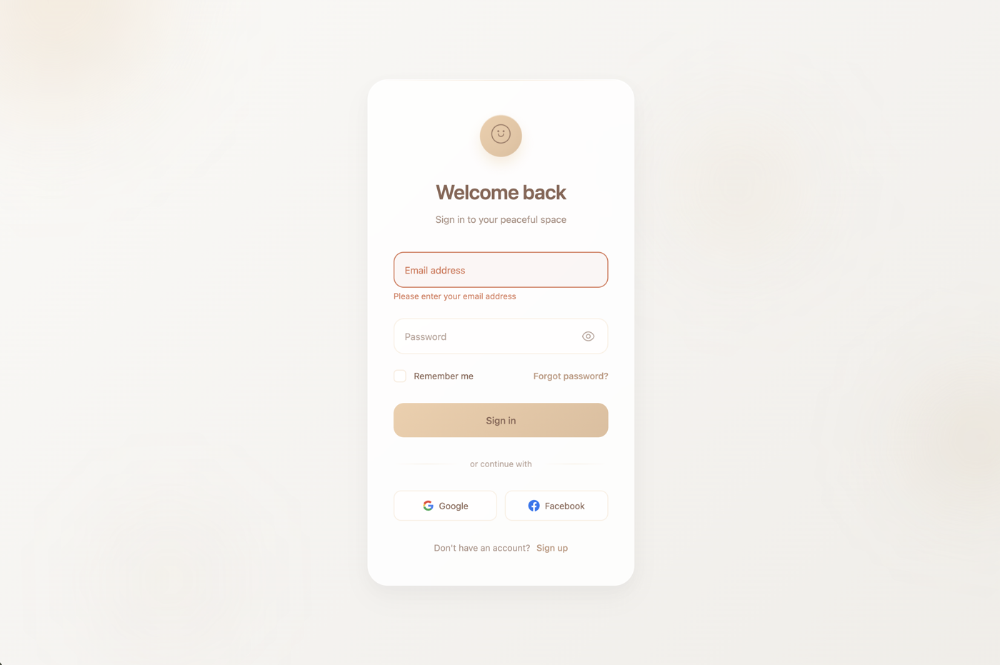
        </a>
        <br>
        <b>Soft Minimalism</b><br>
        <sub>Warm & organic</sub><br>
        <a href="https://puikinsh.github.io/login-forms/forms/soft-minimalism/">Live Demo</a> | <a href="forms/soft-minimalism/">Source</a>
      </td>
      <td align="center">
        <a href="https://puikinsh.github.io/login-forms/forms/retro-future/">
          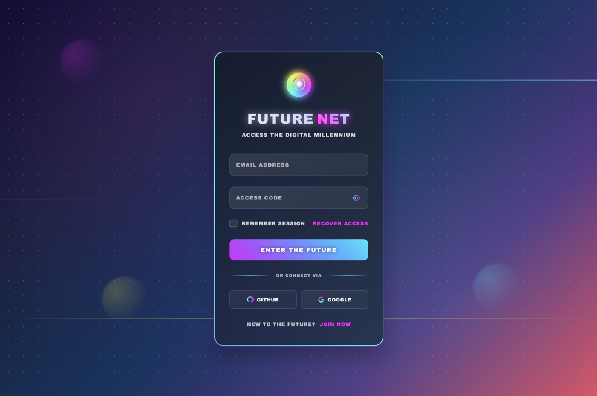
        </a>
        <br>
        <b>Retro Future</b><br>
        <sub>Y2K revival style</sub><br>
        <a href="https://puikinsh.github.io/login-forms/forms/retro-future/">Live Demo</a> | <a href="forms/retro-future/">Source</a>
      </td>
      <td align="center">
        <a href="https://puikinsh.github.io/login-forms/forms/minimal-music/">
          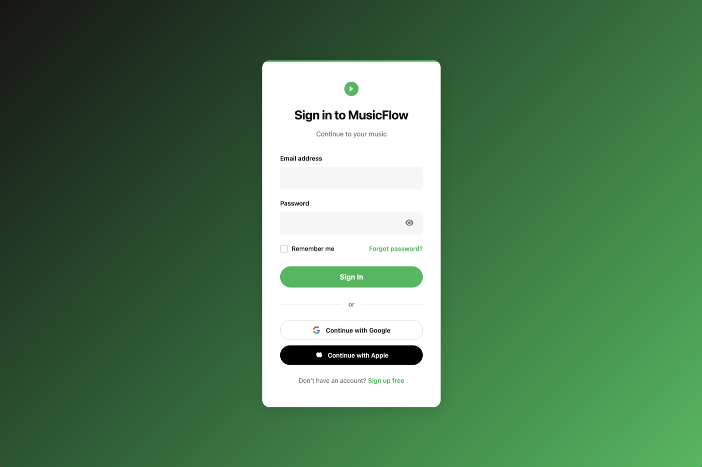
        </a>
        <br>
        <b>Minimal Music</b><br>
        <sub>Spotify-inspired</sub><br>
        <a href="https://puikinsh.github.io/login-forms/forms/minimal-music/">Live Demo</a> | <a href="forms/minimal-music/">Source</a>
      </td>
    </tr>
    <tr>
      <td align="center">
        <a href="https://puikinsh.github.io/login-forms/forms/travel-booking/">
          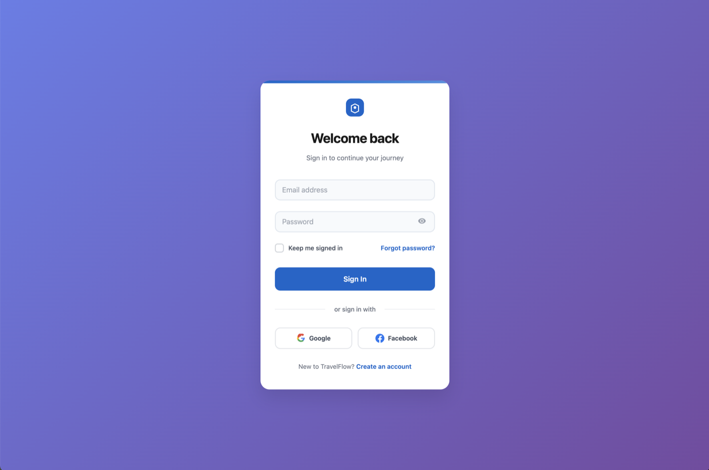
        </a>
        <br>
        <b>Travel Booking</b><br>
        <sub>Travel industry theme</sub><br>
        <a href="https://puikinsh.github.io/login-forms/forms/travel-booking/">Live Demo</a> | <a href="forms/travel-booking/">Source</a>
      </td>
      <td align="center">
        <a href="https://puikinsh.github.io/login-forms/forms/clean-banking/">
          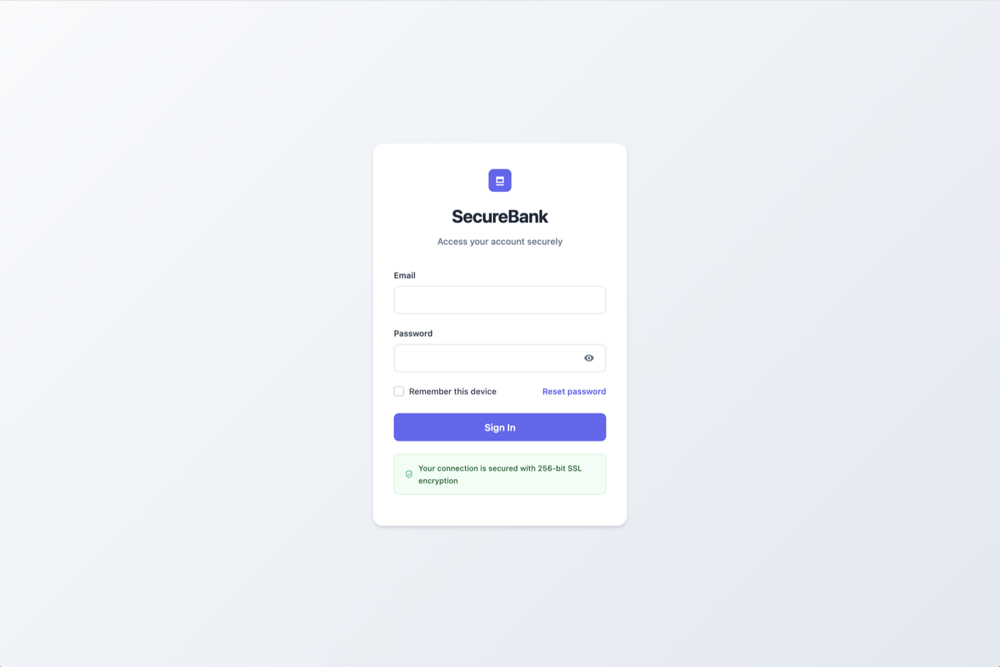
        </a>
        <br>
        <b>Clean Banking</b><br>
        <sub>Fintech design</sub><br>
        <a href="https://puikinsh.github.io/login-forms/forms/clean-banking/">Live Demo</a> | <a href="forms/clean-banking/">Source</a>
      </td>
      <td align="center">
        <a href="https://puikinsh.github.io/login-forms/forms/modern-saas/">
          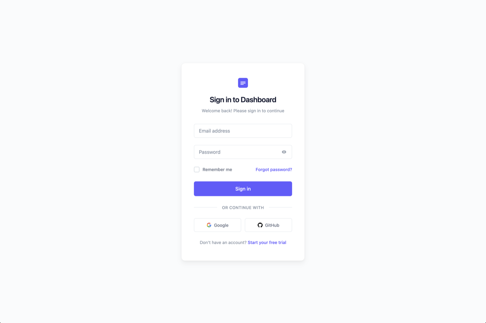
        </a>
        <br>
        <b>Modern SaaS</b><br>
        <sub>Stripe-inspired</sub><br>
        <a href="https://puikinsh.github.io/login-forms/forms/modern-saas/">Live Demo</a> | <a href="forms/modern-saas/">Source</a>
      </td>
    </tr>
    <tr>
      <td align="center">
        <a href="https://puikinsh.github.io/login-forms/forms/elegant-portfolio/">
          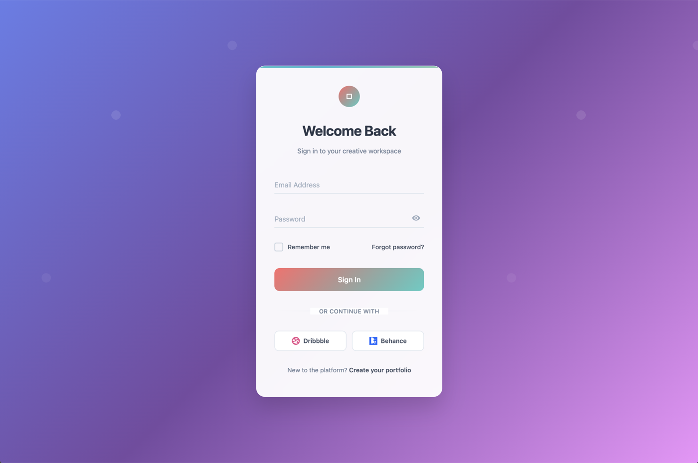
        </a>
        <br>
        <b>Elegant Portfolio</b><br>
        <sub>Creative professional</sub><br>
        <a href="https://puikinsh.github.io/login-forms/forms/elegant-portfolio/">Live Demo</a> | <a href="forms/elegant-portfolio/">Source</a>
      </td>
      <td align="center">
        <a href="https://puikinsh.github.io/login-forms/forms/brutalist/">
          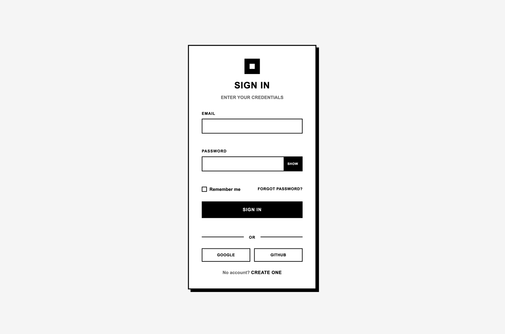
        </a>
        <br>
        <b>Brutalist</b><br>
        <sub>Bold & minimal</sub><br>
        <a href="https://puikinsh.github.io/login-forms/forms/brutalist/">Live Demo</a> | <a href="forms/brutalist/">Source</a>
      </td>
      <td align="center">
        <!-- Empty cell for grid alignment -->
      </td>
    </tr>
  </table>
</div>

## 📂 Forms by Category

### 🎨 Modern & Stylish
- **[Glassmorphism](forms/glassmorphism/)** - Frosted glass effects with backdrop blur
- **[Neon Minimalist](forms/neon/)** - Dark theme with glowing neon accents
- **[Gradient Wave](forms/gradient-wave/)** - Dynamic gradient animations
- **[Neumorphism](forms/neumorphism/)** - Soft UI with realistic shadows

### 💼 Corporate & Clean  
- **[Corporate Professional](forms/corporate/)** - Enterprise-grade with SSO integration
- **[Material Design](forms/material/)** - Google's Material Design principles
- **[Clean Banking](forms/clean-banking/)** - Fintech-inspired professional design
- **[Modern SaaS](forms/modern-saas/)** - Stripe-inspired minimal design

### 🎯 Minimal & Simple
- **[Basic Form](forms/basic/)** - Simple, functional design for quick implementation
- **[Minimal Clean](forms/minimal/)** - Ultra-clean using system fonts
- **[Soft Minimalism](forms/soft-minimalism/)** - Warm minimalism with organic shapes
- **[Brutalist](forms/brutalist/)** - Bold, raw aesthetic

### 🎨 Creative & Artistic
- **[Creative Portal](forms/creative/)** - Interactive animations with floating shapes
- **[Retro Future](forms/retro-future/)** - Y2K revival with chrome effects
- **[Elegant Portfolio](forms/elegant-portfolio/)** - Dribbble-inspired creative design

### 🌟 Themed & Unique
- **[AI Assistant](forms/ai-assistant/)** - Neural network-inspired design
- **[Eco Wellness](forms/eco-wellness/)** - Nature-inspired with organic shapes
- **[Neon Cyber](forms/neon-cyber/)** - Cyberpunk gaming aesthetic
- **[Minimal Music](forms/minimal-music/)** - Spotify-inspired clean design
- **[Travel Booking](forms/travel-booking/)** - Travel industry themed

## 🛠️ Quick Start

### 1. Browse & Choose

Open `index.html` in your browser to see all forms in action with live previews.

### 2. Copy Form Files

Each form is self-contained in its own directory:
```
forms/[form-name]/
├── index.html    # Form HTML structure
├── style.css     # Complete styling
├── script.js     # Form functionality
└── README.md     # Documentation
```

### 3. Include the shared utilities

Copy `shared/js/form-utils.js` alongside your form folder. It provides:

- `FormUtils.LoginFormBase` — the form lifecycle base class every form extends
- `FormUtils.validateEmail` / `validatePassword` — drop-in validators
- `FormUtils.showNotification` — XSS-safe toast (uses `textContent`, not `innerHTML`)
- `FormUtils.setupFloatingLabels` / `setupPasswordToggle` — common UI helpers

### 4. Customize

- Modify colors and styling in `style.css`
- Adjust the base class options in `script.js` (form-group selector, validators, elements to hide on success, etc.) — see any per-form `script.js` for examples (most are 30–80 lines)
- Update text and labels in `index.html`

### Demo credentials

The included `simulateLogin` always succeeds **except** for one specific combination, used to demonstrate error states:

- email: `admin@demo.com`
- password: `wrongpassword`

## 📁 Project Structure

```
login-forms/
├── index.html                  # Main showcase page (gallery)
├── CHANGELOG.md                # Project history
├── shared/
│   └── js/
│       └── form-utils.js      # FormUtils helpers + LoginFormBase class
├── forms/                     # 20 self-contained form templates
│   ├── glassmorphism/
│   ├── neon/
│   ├── minimal/
│   └── ... (20 forms total)
├── assets/
│   └── screenshots/           # 1400px-wide PNG previews
└── docs/
    ├── design-guide.md
    └── screenshot-integration-guide.md
```

## 🎯 Form Features

Each form includes:

- ✅ Email and password inputs with validation
- ✅ Floating label animations
- ✅ Password visibility toggle
- ✅ Real-time validation feedback
- ✅ Loading and success states
- ✅ Responsive mobile-first design
- ✅ ARIA labels on icon controls + visible keyboard focus rings
- ✅ Honors `prefers-reduced-motion`
- ✅ Meta description, Open Graph image, Twitter card, and SVG favicon
- ✅ Remember me checkbox, forgot password and sign up links

## 🏛 Architecture

Every form is backed by `FormUtils.LoginFormBase` (in `shared/js/form-utils.js`). The base class owns the lifecycle:

```js
class GlassmorphismLoginForm extends FormUtils.LoginFormBase {
    constructor() {
        super({
            hideOnSuccess: ['.divider', '.social-login', '.signup-link'],
            // optional: validators, formGroupSelector, cardSelector,
            // submitButtonSelector
        });
    }

    decorate() {
        // form-specific entrance animations or visual flourishes go here
    }
}
```

What the base class handles for you:

- form submit, validation, and field-level error display
- floating labels, password toggle, success state and reset
- forgot-password, sign-up, and social-login link defaults
- form-scoped keyboard shortcuts (no document-level leaks)
- shake/animation cleanup via `animationend` (no `setTimeout` races)

What you override per form:

- `decorate()` for entrance effects, particles, parallax, glitch, etc.
- `onSuccess()` if your form needs a custom success transition
- constructor options for selectors and validators that differ from the defaults

Per-form scripts ended up between **14 and 115 lines** — down from 105 to 542 lines before the refactor.

## 🎨 Customization Guide

### Colors & Theming
Each form uses CSS variables or inline styles that can be easily modified:
- Primary colors
- Background gradients
- Text colors
- Border styles

### Form Validation
Validation rules in `shared/js/form-utils.js`:
- Email format validation
- Password strength requirements
- Custom error messages
- Success confirmations

### Animations
- Entrance animations
- Hover effects
- Focus transitions
- Success celebrations

## 🔧 Technical Details

### Browser Support
| Browser | Version |
|---------|---------|
| Chrome  | 88+     |
| Firefox | 103+    |
| Safari  | 15.4+   |
| Edge    | 88+     |

### Performance

- No external runtime dependencies — no CDN, no Google Fonts, no npm
- Screenshots stored at 1400px PNG (down from 3144px originals — 28 MB → 8.9 MB total)
- Lazy-loading on gallery images
- ~1,400 lines of JavaScript across all 20 forms (down from ~5,600 before the base-class refactor)

### Accessibility

- Visible keyboard focus rings via `:focus-visible` (mouse users unaffected)
- Honors `prefers-reduced-motion: reduce` globally — animations collapse to ~0ms
- Semantic HTML, ARIA labels on icon-only controls, `role="alert"` / `role="status"` on toasts
- Form-scoped keyboard handlers (no document-level listener leaks)
- All inputs have `autocomplete` hints (`email`, `current-password`)

### Security

- `FormUtils.showNotification` uses `textContent` instead of `innerHTML` — error messages from the auth backend cannot inject HTML
- No `eval`, no `new Function`, no inline event handlers anywhere

## 🤝 Contributing

We welcome contributions! Feel free to:
- Submit bug reports and feature requests
- Create new form designs following our guidelines
- Improve existing forms and documentation
- Share your customizations and use cases

## 📝 License

This project is created by [Aigars Silkalns](https://github.com/puikinsh) for [Colorlib](https://colorlib.com).

## 📜 Changelog

See [CHANGELOG.md](CHANGELOG.md) for a full history of releases — including the 2.0 refactor that introduced the shared `LoginFormBase` class, accessibility improvements, security fixes, and an 80%+ reduction in per-form JavaScript.

## 📞 Support & Resources

- 🌐 Visit [Colorlib](https://colorlib.com) for more web design resources
- 📋 Browse [Login Forms Collection](https://colorlib.com/wp/cat/login-forms/)
- 🎨 Explore [HTML5 & CSS3 Login Forms](https://colorlib.com/wp/html5-and-css3-login-forms/)
- 💻 Check out [Aigars Silkalns' GitHub](https://github.com/puikinsh/) for other projects
- 🐛 Open an issue in this repository for bug reports

---

**Built with ❤️ by [Aigars Silkalns](https://github.com/puikinsh/) for [Colorlib](https://colorlib.com)**